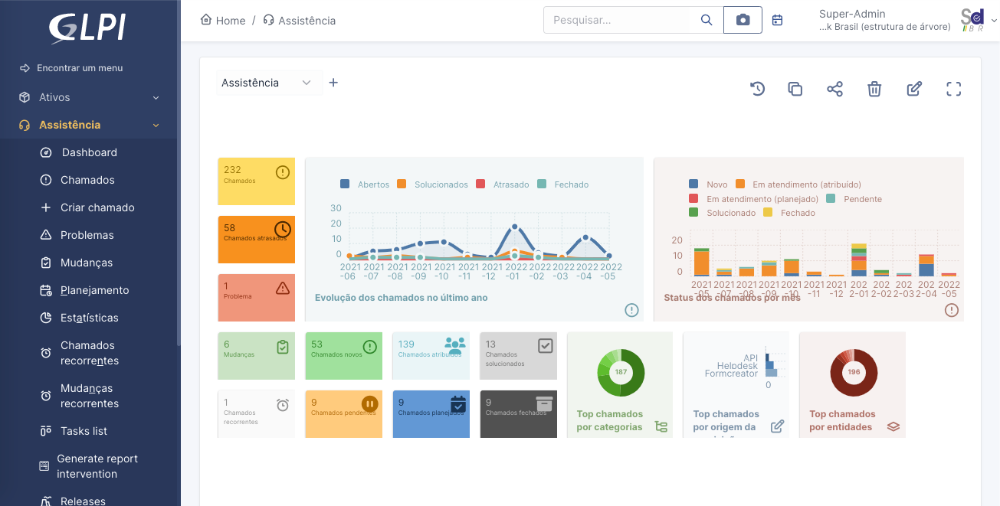
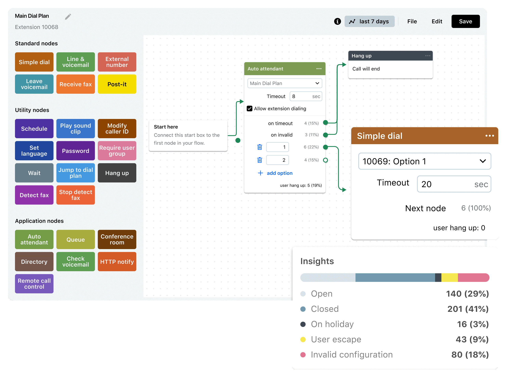
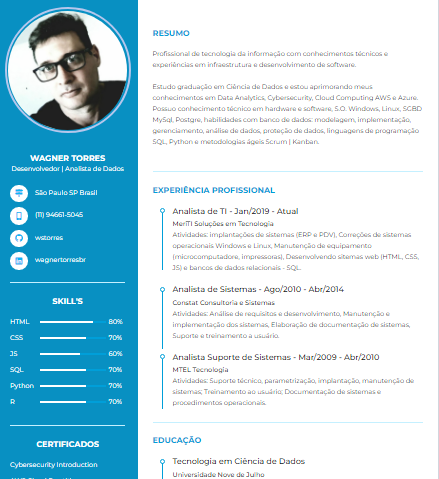

  

  

  <text align="justify" margin-left="20px">

### Welcome My Github!
#### I'm WAGNER TORRES

Data Scientist | Service Desk Management Specialist |

Technology professional with over 15 years of experience, focusing heavily on IT service management; implementing solutions, system consulting, team leadership, infrastructure monitoring, IT service availability, process mapping and improvement, KPI development, and compliance with service level agreements established with clients. [Linkedin](https://linkedin.com/in/wstorres). 
 
### About me 

  [)](https://github.com/wstorres)
  
  

 

- Thanks for visiting. 
  
- Enjoy it!! 
  

 

---

<h3 align="center">⭐ Achievements ⭐</h3>

 

 

<!--
---
### Skills

- **Languages**:&nbsp;&nbsp;&nbsp;&nbsp;&nbsp;&nbsp; Python, SQL, R, C/C++
- **Web Analytcs**:&nbsp;                 Excel, Google Sheets, Tableau
- **Data Base**:&nbsp;&nbsp;&nbsp;&nbsp;&nbsp;&nbsp;&nbsp; MySql, Postgre
- **TI Service Management**
- **Leadership and Team Development**
- **Data Analysis and Reporting**
- **Innovation and Problem Solving**
- **Committed to Excellence and Value Generation**
- **Process Mapping and Improvement**:&nbsp;   Notation BPMN
- **Identification of Critical Tasks and Proposal of Solutions**
- **Monitoring Compliance with Actions**
- **Process Training and Auditing**
- **Building KPIs for Process Monitoring**
- **IT Certifications**:&nbsp;  ITIL, ISO 20000, COBIT, and Lean Six Sigma
 

### Education

- [Pós-graduação Gerenciamento de Projetos](#) | *Universitade Puntifícia Católica (2003 - Atual)*
- [Graduação em Ciência de Dados](#) | *Universidade Nove de Julho (2021 - 2023)*
- [Graduação em Gestão de TI](#) | *Universidade Paulista (2003 - 2006)*

 

### Work Experience 

| **Job Position**       | **Company**                            | **Field**            | **Work Period**     |
| ---------------------- | ---------------------------            | -------------------- | ------------------  |
| Supervisor de TI       | Liberty Healt Tech                     | Infra, Negócios      | Abr 2023 / Atual    | 
| Analista de TI         | Wtime Consultoria Empresarial          | Infra                | Nov 2022 / Abr 2023 |  
| Analista de TI         | MeriTI Consultoria                     | Infra, Dev           | Jan 2019 / Out 2022 |  
| Analista de Sistemas   | Constat Consultoria                    | Infra, Dev           | Abr 2011 / Mar 2014 |
| Analista Sup Sistemas  | MTEL Tecnologia                        | Infra                | Mar 2099 / Abr 2010 |
| Tecnico Informnatica   | Consoft Consultoria                    | Infra                | Jan 2006 / Mar 2009 |

 
-->
---
💪💪 Estudo de novas tecnologias 💪💪

---

### New Projects 
**[Updating ...](#)** New Projects section you will find my most recent work experience:

**Implantação ITSM GLPI** \
[**PMO**](https://wstorres.github.io/ITSM-GLPI/) • Full-time \
Linguagens & Tecnologias: `Agil`, `Devops`, `PHP`, `ITIL4`, `ISO20000`, `BPM`\
Projetos em destaque: [Rocket](#), [Marte](#)
 

**Implantação URA GoTo** \
[**PMO**](https://wstorres.github.io/URA-GOTO/) • Full-time \
Linguagens & Tecnologias: `Agil`, `Devops`, `BPM`\
Projetos em destaque: [Rocket](#), [Marte](#)
 

**Implantação Unidade de Service Desk** \
[**PMO**](https://wstorres.github.io/central-servicos-suporte/) • Full-time \
Linguagens & Tecnologias: `Agil`, `Devops`, `BPM`\
Projetos em destaque: [Rocket](#), [Marte](#)
 

**Front-end Developer** \
[**Web Profile**](https://wstorres.github.io/curriculo-designer/) • Full-time \
Linguagens & Tecnologias: `HTML`, `CSS`, `JavaScript`, `Bootstrap`, `Github Pages`,\
Projetos em destaque: [Rocket](#), [Marte](#)
 

**Frot-end Developer** \
[**AE-Transportes**](#/) • Contract \
Linguagens & Tecnologias: `HTML`, `CSS`, `JavaScript`, `Bootstrap`, `Github Pages`,\
Projetos em destaque: [Ignite](#), [Bootcamp](#)
 

<!--

**Software Engineer** \
[**Nubank**](https://nubank.com.br/) • Contract \
Linguagens & Tecnologias: `React Native`, `Node`, `Swift`, `Kotlin`, `OpenShift` \
Projetos em destaque: [App](https://nubank.com.br/)
 
-->
 

### Github Status

 

 

  <a href="https://github.com/wstorres">

  

  

